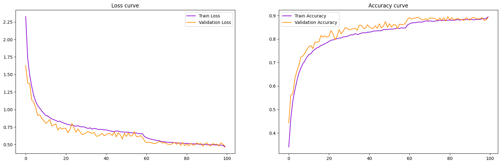

# CIFAR-10 Image Classifier with Streamlit Interface

  
  
  

---

## 🧠 Project Overview

This project demonstrates a **deep learning-based image classifier** trained on the **CIFAR-10 dataset** using a custom **Convolutional Neural Network (CNN)** built with **Keras (TensorFlow backend)**. The dataset consists of 60,000 32x32 color images in 10 classes:
- Airplane ✈️
- Automobile 🚗
- Bird 🐦
- Cat 🐱
- Deer 🦌
- Dog 🐕
- Frog 🐸
- Horse 🐴
- Ship 🚢
- Truck 🚚

To make the model accessible and interactive, I built a lightweight **Streamlit web app** (in the app.py file) that allows users to upload an image and get a real-time prediction of the object class. This project showcases my skills in model building, training pipelines, image preprocessing, UI development, and deployment for real-world interaction.

🎬 **Demo Video**: [Watch on YouTube](https://youtu.be/ZLUyQeKUUeM)

---

## 📌 Features

- 🧱 CNN model with batch normalization, dropout, and regularization
- 🔁 Data augmentation to improve generalization
- 📈 Training with early stopping and learning rate reduction
- 📊 Real-time prediction via a Streamlit UI
- 📷 User-uploaded image preprocessing pipeline
- ✅ Normalization based on training data statistics

---
## 🏗️ Model Architecture

The CNN architecture consists of:
- 4 convolutional blocks with increasing filters (32 → 64 → 128 → 256)
- Batch normalization after each convolutional layer
- Max pooling for dimensionality reduction
- Dropout layers for regularization (increasing from 0.2 to 0.5)
- L2 weight regularization (λ=0.0001)
- Final dense layer with softmax activation

---
## 📉 Learning Curve

Here's the training and validation performance over time:

---
## 🧪 Evaluation on the test set

test_loss: 0.5033132433891296
test_accuracy: 0.890999972820282

---
## 🚀 Tech Stack

- **Python 3.10+**
- **TensorFlow / Keras**
- **NumPy, Matplotlib, scikit-learn**
- **Streamlit** for the user interface
- **PIL** for image handling

---
## 🖼️ CIFAR-10 Dataset

The [CIFAR-10](https://www.cs.toronto.edu/~kriz/cifar.html) dataset consists of 60,000 32x32 color images in 10 classes:

